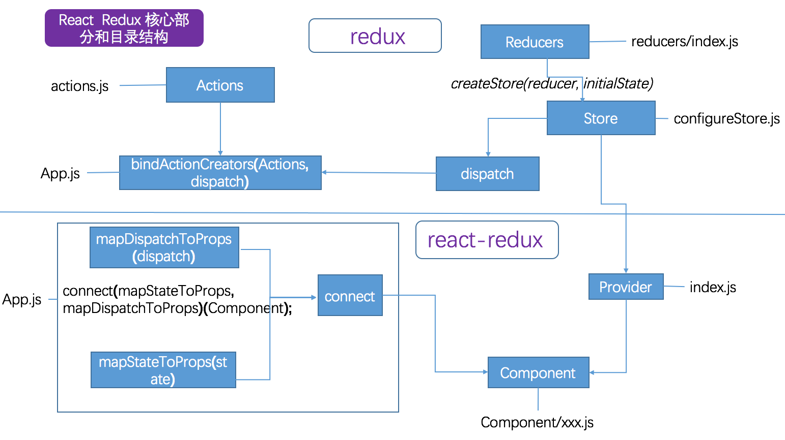

# Redux 基础

* Redux 主要包含三部分 Action、Reducer 及 Store。
* 通过 redux 提供的 bindActionCreators 把 actions 与 dispatch 关联
* 通过 redux 提供的 createStore 并传入 reducers 来生成 store，store 中包含了 dispatch。`createStore(reducer, initialState)`
* 这样通过生成的 dispatch 间接的把 actions 和 reducers 关联起来了
* react-redux 是通过 Provider 和 connect 把 React 与 Redux 关联起来
* Provider 注入了 store 对象，并且利用 context 使子组件能够调用 store
* connect 把 actionsProps 和 stateProps 传入，并创建新的 Connect 组件，该组件包裹了用户定义的组件。在 Connect 组件中利用 Provider 传入的 store 来处理 actionsProps 和 stateProps，并最终转换为 react props 传递到用户自定义组件中，在用户自定义组件中就能调用 actions 和 stateProps  了。

React Redux 核心部分与代码目录组织结构图



下面结合实例和源代码依次展开分析

## Action

在 Redux 中，action 主要用来传递操作 State 数据，以 javascript Plain Object 的形式存在，我们可以通过创建函数来生产 action，这类函数统称为 Action Creator。
在 action 中 type 属性是必要的，用来表明处理 state 数据的方式，除了 type 字段外，action 对象的结构可自己定义，建议尽可能简单。

```javascript
export function addPerson(person) {
  return {
    type: ActionTypes.ADD_PERSON,
    person
  };
}
```

在 action 中我们也可以创建一个被绑定的 action 函数，通过调用 dispatch 调用它们。

```javascript
export function filterSave(person) {
  return (dispatch, getState) => {
    const {forbid} = getState();
    if (forbid) {
      return;
    }
    dispatch(addPerson(person));
  };
}
```
由于 filterSave 返回的是一个函数，
而在 createStore 中 dispatch(action) 传入的参数必须是一个包含 type 属性的对象 action，
所以这时需要通过中间件来创建生成 store。

## Reducer

Action 只是描述了要操作的方法，并没有具体实现如何更新 state，而这正是 reducer 要做的事情。Reducer 一般为简单的处理函数，通过传入旧的 state 和操作行为的 action 来更新 state。

```javascript
export default function personsReducer(state = initState, action) {
  switch (action.type) {
    case ActionTypes.ADD_PERSON:
      // 更新 state 列表数据
      return [{
        id: state.reduce((maxId, person) => Math.max(person.id, maxId), -1) + 1,
        firstName: action.person.firstName,
        lastName: action.person.lastName,
        completed: false
      }, ...state];
    case ActionTypes.DELETE_PERSON:
      return state.filter(person =>
        person.id !== action.id
      );
    case ActionTypes.EDIT_PERSON:
      return state.map(person =>
        person.id === action.person.id ?
          Object.assign({}, person, {
            firstName: action.person.firstName,
            lastName: action.person.lastName
          }) :
          person
      );
    case ActionTypes.LIST_PERSON:
      return state;
    default:
      return state;
  }
}
```

* state 数据要尽量范式化，不要嵌套，可以利用 [normalizr](https://github.com/gaearon/normalizr) 来开发 state
* 在方法中不要修改 state，而应该生成新的 state
* 拆分 Reducers，把相对独立的 state 拆分成多个

Redux 提供了 `combineReducers()` 方法把多个 reducer 组合到一块，看以下的示例

```javascript
import {combineReducers} from 'redux';

import personsReducer from './persons';
import filterReducer from './filter';
import forbidReducer from './forbid';

/**
 * combineReduceres 会返回一个函数 function combination(state = {}, action){}
 * 当调用 createStore 创建 store 时，会通过初始化调用 dispatch 方法，在 dispatch 方法中
 * 再调用 combination，遍历执行所有的 reducers，返回新的 state
 * 除了在初始化时调用，在调用 action 的时候也会调用 dispatch
 * 该例子中初始化时会返回形如以下 state 数据
  {
    persons: [{
      id: 0,
      firstName: '张',
      lastName: '三',
      completed: false
    }],
    filter: 'all',
    forbid: false
  }
 */
export default combineReducers({
  persons: personsReducer,
  filter: filterReducer,
  forbid: forbidReducer
});

```
`combineReducers()` 所做的只是生成一个函数，这个函数来调用一系列 reducer，每个 reducer 根据它们的 key 来筛选出 state 中的一部分数据并处理，然后这个生成的函数所有 reducer 的结果合并成一个大的对象。

下面给出 combineReducers 的源代码，供参考

[import:1-15, combineReducers.js](../codes/redux/combineReducers.js)


## Store

Action 用来表达操作的行为，Reducer 根据 Action 来更新 State。Store 是一个把 Action 和 Reducer 结合起来的对象，返回的对象中有四个属性，分别为

* dispatch(action) // dispatch 函数，调用当前 reducer 返回最新的 state
* subscribe(listener) // 订阅-取消函数
* getState() // 返回 state
* replaceReducer(reducer) // 替换 reducer

Redux 应用只有一个单一的 store。当需要拆分处理数据的逻辑时，使用 reducer 组合而不是创建多个 store。

store 是通过调用 `createStore(reducer, initialState);` 来创建的，对于异步等操作，我们需要通过中间件来创建

createStore 源码

[import:1-15, createStore.js](../codes/redux/createStore.js)
